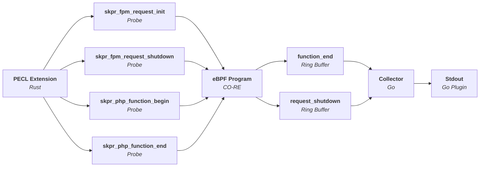

Compass
=======

A tool for pointing developers in the right direction for performance issues.

----

## Architecture

## Components

| Directory | Description                                                                                      |
|-----------|--------------------------------------------------------------------------------------------------|
| extension | PHP extension which implements USDT probes using PHP's Oberserver APi.                           |
| bpftrace  | bpftrace scripts for testing the extension and demonstrating how the probes can be utilised.     |
| example   | Example for testing purposes.                                                                    |
| collector | Listens to USDT probes, collates them and sends them to the collector plugin (stdout, file etc). |

