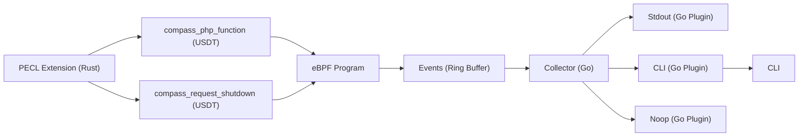

Compass
=======

A tool for pointing developers in the right direction for performance issues.


----

## Architecture



## Components

| Directory | Description                                                                                      |
|-----------|--------------------------------------------------------------------------------------------------|
| extension | PHP extension which implements USDT probes using PHP's Oberserver APi.                           |
| bpftrace  | bpftrace scripts for testing the extension and demonstrating how the probes can be utilised.     |
| example   | Example for testing purposes.                                                                    |
| collector | Listens to USDT probes, collates them and sends them to the collector plugin (stdout, file etc). |

## Trace

Compass provides developers with 2 types of traces:

* Complete - All function calls.
* Aggregated - Functions executed within the same span are combined.

Below is a condensed example:

```json
{
  "requestID": "55eefc9aa6008d539ef954aff41806a7",
  "startTime": 1726972907007464,
  "executionTime": 6054,
  "functionCalls": [
    {
      "name": "Symfony\\Component\\DependencyInjection\\Compiler\\Compiler::compile",
      "startTime": 1726972907128013,
      "endTime": 1726972907517795
    },
    {
      "name": "Symfony\\Component\\DependencyInjection\\ContainerBuilder::compile",
      "startTime": 1726972907128009,
      "endTime": 1726972907518593
    },
    {
      "name": "Drupal\\Core\\DrupalKernel::compileContainer",
      "startTime": 1726972907009684,
      "endTime": 1726972907518625
    },
    {
      "name": "Drupal\\Core\\DrupalKernel::initializeContainer",
      "startTime": 1726972907008223,
      "endTime": 1726972907612239
    },
    {
      "name": "Drupal\\Core\\DrupalKernel::boot",
      "startTime": 1726972907008040,
      "endTime": 1726972907612295
    }
  }
}
```

## Images

**PHP Extension**

```
ghcr.io/skpr/compass:extension-8.3-latest
ghcr.io/skpr/compass:extension-8.2-latest
ghcr.io/skpr/compass:extension-8.1-latest
```

**Collector**

```
ghcr.io/skpr/compass:collector-latest
```

## Configuration

| COMPONENT          | ENVIRONMENT VARIABLE                        | DEFAULT VALUE                   | Description                                                                                                                                                                     |
|--------------------|---------------------------------------------|---------------------------------|---------------------------------------------------------------------------------------------------------------------------------------------------------------------------------|
| Extension          | COMPASS_ENABLED                             | false                           | Enable the Compass extension                                                                                                                                                    |
| Extension          | COMPASS_MODE                                |                                 | What mode the extension should operate. Empty will collect all executions. Setting to "header" will only collect executions when a specific header is set (see COMPASS_HEADER). |
| Extension          | COMPASS_HEADER                              |                                 | Used to lock down which executions are traced. Need to set `X-Compass` for requests and needs to match this config.                                                             |
| Extension          | COMPASS_FUNCTION_THRESHOLD                  | 10000                           | Watermark for which functions to trace.                                                                                                                                         |
| Collector          | COMPASS_COLLECTOR_PLUGIN                    | /usr/lib64/compass/stdout.so    | Path to the plugin that should called by the collector.                                                                                                                         |
| Collector          | COMPASS_COLLECTOR_LOG_LEVEL                 | info                            | Logging level for the collector component. Set to "debug" for debug notices.                                                                                                    |
| Collector (Helper) | COMPASS_PROCESS_NAME                        | php-fpm                         | Name of the process to trace.                                                                                                                                                   |
| Collector (Helper) | COMPASS_LIB_PATH                            | /usr/lib/php/modules/compass.so | Path to extension library which has probes.                                                                                                                                     |
| Collector (Plugin) | COMPASS_COLLECTOR_CLI_ENDPOINT              | http://localhost:27624          | Endpoint to send traces to for the CLI component.                                                                                                                               |
| Collector (Plugin) | COMPASS_COLLECTOR_STDOUT_REQUEST_THRESHOLD  | 100                             | Watermark for which requests to trace.                                                                                                                                          |
| Collector (Plugin) | COMPASS_COLLECTOR_STDOUT_FUNCTION_THRESHOLD | 10                              | Watermark for which functions to trace.                                                                                                                                         |
