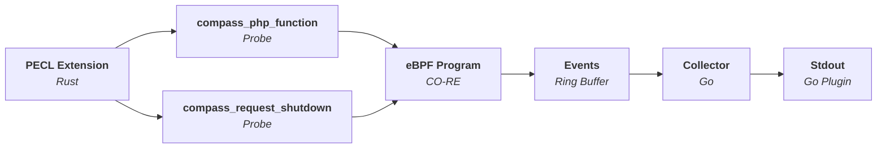

Compass
=======

A tool for pointing developers in the right direction for performance issues.


----

## Architecture



## Components

| Directory | Description                                                                                      |
|-----------|--------------------------------------------------------------------------------------------------|
| extension | PHP extension which implements USDT probes using PHP's Oberserver APi.                           |
| bpftrace  | bpftrace scripts for testing the extension and demonstrating how the probes can be utilised.     |
| example   | Example for testing purposes.                                                                    |
| collector | Listens to USDT probes, collates them and sends them to the collector plugin (stdout, file etc). |

## Trace

Compass provides developers with aggregated trace data for determining:

* How many times a function was called
* Total execution time for a function

Below is a condensed example:

```json
{
  "requestID": "55eefc9aa6008d539ef954aff41806a7",
  "startTime": 1726972907007464,
  "executionTime": 6054,
  "functionCalls": [
    {
      "name": "Symfony\\Component\\DependencyInjection\\Compiler\\Compiler::compile",
      "startTime": 1726972907128013,
      "endTime": 1726972907517795
    },
    {
      "name": "Symfony\\Component\\DependencyInjection\\ContainerBuilder::compile",
      "startTime": 1726972907128009,
      "endTime": 1726972907518593
    },
    {
      "name": "Drupal\\Core\\DrupalKernel::compileContainer",
      "startTime": 1726972907009684,
      "endTime": 1726972907518625
    },
    {
      "name": "Drupal\\Core\\DrupalKernel::initializeContainer",
      "startTime": 1726972907008223,
      "endTime": 1726972907612239
    },
    {
      "name": "Drupal\\Core\\DrupalKernel::boot",
      "startTime": 1726972907008040,
      "endTime": 1726972907612295
    }
  }
}
```

## Images

**PHP Extension**

```
ghcr.io/skpr/compass:extension-8.3-latest
ghcr.io/skpr/compass:extension-8.2-latest
ghcr.io/skpr/compass:extension-8.1-latest
```

**Collector**

```
ghcr.io/skpr/compass:collector-latest
```
