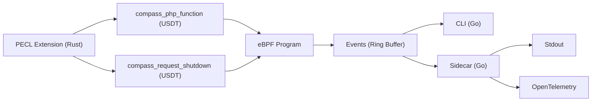

Compass
=======

A tool designed to guide developers in the right direction for identifying and resolving performance issues.


----

## Architecture



## Performance


Performance data can be found in Github Actions for [this build](https://github.com/skpr/compass/pull/77).

## Components

| Directory | Description                                                                                  |
|-----------|----------------------------------------------------------------------------------------------|
| bpftrace  | bpftrace scripts for testing the extension and demonstrating how the probes can be utilised. |
| extension | PHP extension which implements USDT probes.                                                  |
| cli       | Commandline interface that collects telemetry from USDT probes.                              |
| sidecar   | Sidecar that collects telemetry from USDT probes and log to stdout.                          |

## CLI


## Trace

Compass provides developers with 2 types of traces:

* Complete - All function calls.
* Aggregated - Functions executed within the same span are combined.

Below is a condensed example:

```json
{
  "requestID": "55eefc9aa6008d539ef954aff41806a7",
  "startTime": 1726972907007464,
  "executionTime": 6054,
  "functionCalls": [
    {
      "name": "Symfony\\Component\\DependencyInjection\\Compiler\\Compiler::compile",
      "startTime": 1726972907128013,
      "endTime": 1726972907517795
    },
    {
      "name": "Symfony\\Component\\DependencyInjection\\ContainerBuilder::compile",
      "startTime": 1726972907128009,
      "endTime": 1726972907518593
    },
    {
      "name": "Drupal\\Core\\DrupalKernel::compileContainer",
      "startTime": 1726972907009684,
      "endTime": 1726972907518625
    },
    {
      "name": "Drupal\\Core\\DrupalKernel::initializeContainer",
      "startTime": 1726972907008223,
      "endTime": 1726972907612239
    },
    {
      "name": "Drupal\\Core\\DrupalKernel::boot",
      "startTime": 1726972907008040,
      "endTime": 1726972907612295
    },
  ],
}
```

## Images

**PHP Extension**

```
ghcr.io/skpr/compass:extension-8.3-latest
ghcr.io/skpr/compass:extension-8.2-latest
ghcr.io/skpr/compass:extension-8.1-latest
```

**Collector**

```
ghcr.io/skpr/compass:collector-latest
```

## Configuration

| COMPONENT     | ENVIRONMENT VARIABLE               | DEFAULT VALUE                   | Description                                                                                                                                                                     |
|---------------|------------------------------------|---------------------------------|---------------------------------------------------------------------------------------------------------------------------------------------------------------------------------|
| Extension     | COMPASS_ENABLED                    | false                           | Enable the Compass extension                                                                                                                                                    |
| Extension     | COMPASS_MODE                       |                                 | What mode the extension should operate. Empty will collect all executions. Setting to "header" will only collect executions when a specific header is set (see COMPASS_HEADER). |
| Extension     | COMPASS_HEADER                     |                                 | Used to lock down which executions are traced. Need to set `X-Compass` for requests and needs to match this config.                                                             |
| Extension     | COMPASS_FUNCTION_THRESHOLD         | 10000                           | Watermark for which functions to trace.                                                                                                                                         |
| CLI + Sidecar | COMPASS_PROCESS_NAME               | php-fpm                         | Name of the process to trace.                                                                                                                                                   |
| CLI + Sidecar | COMPASS_EXTENSION_PATH             | /usr/lib/php/modules/compass.so | Path to extension library which has probes.                                                                                                                                     |
| Sidecar       | COMPASS_SIDECAR_REQUEST_THRESHOLD  | 100                             | Watermark for which requests to trace.                                                                                                                                          |
| Sidecar       | COMPASS_SIDECAR_FUNCTION_THRESHOLD | 10                              | Watermark for which functions to trace.                                                                                                                                         |
| Sidecar       | COMPASS_SIDECAR_LOG_LEVEL          | info                            | Logging level for the collector component. Set to "debug" for debug notices.                                                                                                    |
| Sidecar       | COMPASS_SIDECAR_SINK               | stdout                          | Choose which metrics sink to use.                                                                                                                                               |
| Sidecar       | COMPASS_SIDECAR_OTEL_ENDPOINT      | http://jaeger:4318/v1/traces    | Endpoint to send OpenTelemetry traces to.                                                                                                                                       | 