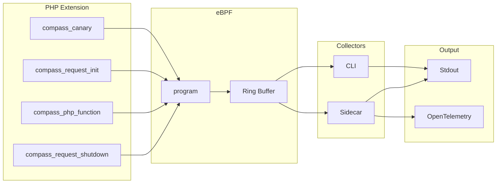

Compass
=======

A tool designed to guide developers in the right direction for identifying and resolving performance issues.


----

## Architecture



## Performance

| Test      | Average | Diff (Compared to Control) |
|-----------|---------|----------------------------|
| Control   | 49ms    |                            |
| Installed | 49ms    | 0ms                        |
| Enabled   | 50ms    | 0ms                        |
| Collector | 57ms    | 7ms                        |

Performance data can be found in Github Actions for [this build](https://github.com/skpr/compass/pull/113).

## Components

| Directory | Description                                                                                  |
|-----------|----------------------------------------------------------------------------------------------|
| extension | PHP extension which implements USDT probes.                                                  |
| cli       | Commandline interface that collects telemetry from USDT probes.                              |
| sidecar   | Sidecar that collects telemetry from USDT probes and log to stdout.                          |

## CLI


## Trace

Compass provides developers with 2 types of traces:

* Complete - All function calls with start and end times.
* Segmented - Functions calls broken into segments. Used to demonstrate scale eg. CLI trace view.
* Count - Totals number of times a function was called.

Below is a condensed example for a complete trace:

```json
{
  "metadata": {
    "requestID": "6f5397b0f605fd92d4db7c89d23f1b76",
    "uri": "/sites/default/files/styles/scale_crop_7_3_wide/public/veggie-pasta-bake-hero-umami.jpg.webp?itok=CYsHBUlX",
    "method": "GET",
    "startTime": 11479712402527,
    "endTime": 11480550685871
  },
  "functionCalls": [
    {
      "name": "PDOStatement::execute",
      "startTime": 11479719656578,
      "elapsed": 5999966
    },
    {
      "name": "Drupal\\Core\\Database\\StatementPrefetchIterator::execute",
      "startTime": 11479719664878,
      "elapsed": 5999966
    },
    {
      "name": "Drupal\\sqlite\\Driver\\Database\\sqlite\\Statement::execute",
      "startTime": 11479719666498,
      "elapsed": 5999966
    },
    {
      "name": "Drupal\\Core\\Database\\Query\\Upsert::execute",
      "startTime": 11479719668488,
      "elapsed": 5999966
    }
  ]
}
```

## Images

These images contain:

* The compiled PHP extension
* Default PHP INI configuration
* The collector (sidecar and CLI)

```
ghcr.io/skpr/compass:extension-8.4-latest
ghcr.io/skpr/compass:extension-8.3-latest
ghcr.io/skpr/compass:extension-8.2-latest
```

## How to test

```bash
git clone git@github.com:skpr/compass
cd compass

# Build the project and up a stack
mise run up

# Run the CLI
docker compose exec compass compass

# Go to http://localhost:8080
# Check back in the CLI
```

## Configuration

| COMPONENT     | ENVIRONMENT VARIABLE               | DEFAULT VALUE                   | Description                                                                                                                                                                     |
|---------------|------------------------------------|---------------------------------|---------------------------------------------------------------------------------------------------------------------------------------------------------------------------------|
| Extension     | COMPASS_ENABLED                    | false                           | Enable the Compass extension                                                                                                                                                    |
| Extension     | COMPASS_FUNCTION_THRESHOLD         | 10000                           | Watermark for which functions to trace.                                                                                                                                         |
| CLI + Sidecar | COMPASS_PROCESS_NAME               | php-fpm                         | Name of the process to trace.                                                                                                                                                   |
| CLI + Sidecar | COMPASS_EXTENSION_PATH             | /usr/lib/php/modules/compass.so | Path to extension library which has probes.                                                                                                                                     |
| Sidecar       | COMPASS_SIDECAR_REQUEST_THRESHOLD  | 100                             | Watermark for which requests to trace.                                                                                                                                          |
| Sidecar       | COMPASS_SIDECAR_FUNCTION_THRESHOLD | 10                              | Watermark for which functions to trace.                                                                                                                                         |
| Sidecar       | COMPASS_SIDECAR_LOG_LEVEL          | info                            | Logging level for the collector component. Set to "debug" for debug notices.                                                                                                    |
| Sidecar       | COMPASS_SIDECAR_SINK               | stdout                          | Choose which metrics sink to use.                                                                                                                                               |
| Sidecar       | COMPASS_SIDECAR_OTEL_ENDPOINT      | http://jaeger:4318/v1/traces    | Endpoint to send OpenTelemetry traces to.                                                                                                                                       |
| Sidecar       | COMPASS_SIDECAR_OTEL_SERVICE_NAME  |                                 | Name of the service assign this trace to.                                                                                                                                       |
