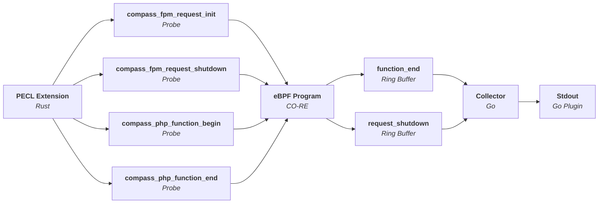

Compass
=======

A tool for pointing developers in the right direction for performance issues.


[](https://github.com/skpr/compass/actions/workflows/test_main.yml)

----

## Architecture



## Components

| Directory | Description                                                                                      |
|-----------|--------------------------------------------------------------------------------------------------|
| extension | PHP extension which implements USDT probes using PHP's Oberserver APi.                           |
| bpftrace  | bpftrace scripts for testing the extension and demonstrating how the probes can be utilised.     |
| example   | Example for testing purposes.                                                                    |
| collector | Listens to USDT probes, collates them and sends them to the collector plugin (stdout, file etc). |

## Images

**PHP Extension**

```
ghcr.io/skpr/compass:extension-8.3-latest
ghcr.io/skpr/compass:extension-8.2-latest
ghcr.io/skpr/compass:extension-8.1-latest
```

**Collector**

```
ghcr.io/skpr/compass:collector-latest
```
