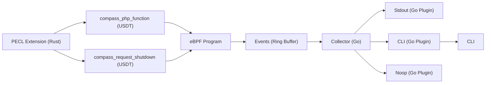

Compass
=======

A tool for pointing developers in the right direction for performance issues.


----

## Architecture



## Components

| Directory | Description                                                                                      |
|-----------|--------------------------------------------------------------------------------------------------|
| extension | PHP extension which implements USDT probes using PHP's Oberserver APi.                           |
| bpftrace  | bpftrace scripts for testing the extension and demonstrating how the probes can be utilised.     |
| example   | Example for testing purposes.                                                                    |
| collector | Listens to USDT probes, collates them and sends them to the collector plugin (stdout, file etc). |

## Trace

Compass provides developers with aggregated trace data for determining:

* How many times a function was called
* Total execution time for a function

Below is a condensed example:

```json
{
  "requestID": "xxxxxxxxxxxxxxxxxxxxxxxx",
  "functions": {
    "Drupal::config": {
      "totalExecutionTime": 139670,
      "invocations": 1
    },
    "Drupal::service": {
      "totalExecutionTime": 1544791,
      "invocations": 2
    },
    "Drupal\\Component\\DependencyInjection\\Container::createService": {
      "totalExecutionTime": 28472850,
      "invocations": 58
    },
    "Drupal\\Component\\DependencyInjection\\Container::get": {
      "totalExecutionTime": 30639000,
      "invocations": 63
    },
    "Drupal\\Component\\DependencyInjection\\Container::resolveServicesAndParameters": {
      "totalExecutionTime": 24442445,
      "invocations": 53
    }
  }
}
```

## Images

**PHP Extension**

```
ghcr.io/skpr/compass:extension-8.3-latest
ghcr.io/skpr/compass:extension-8.2-latest
ghcr.io/skpr/compass:extension-8.1-latest
```

**Collector**

```
ghcr.io/skpr/compass:collector-latest
```
