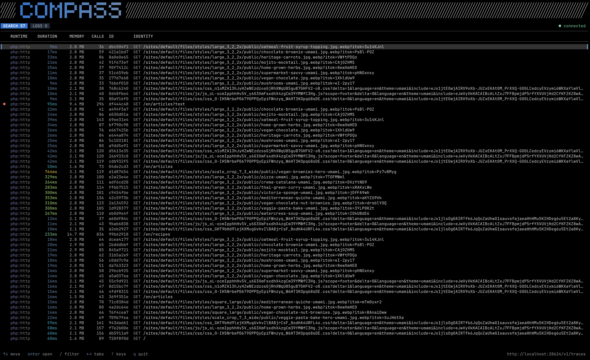
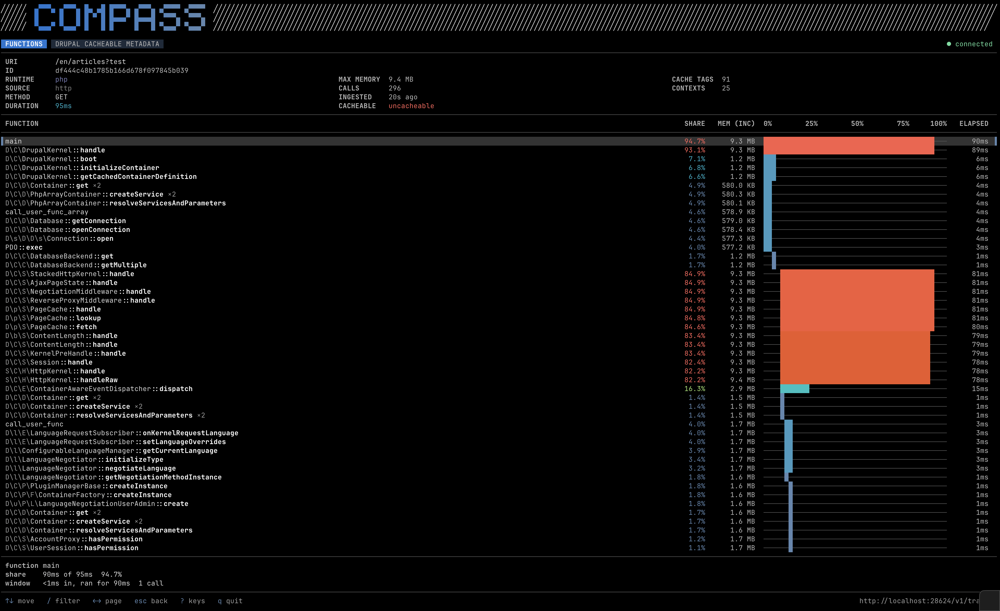
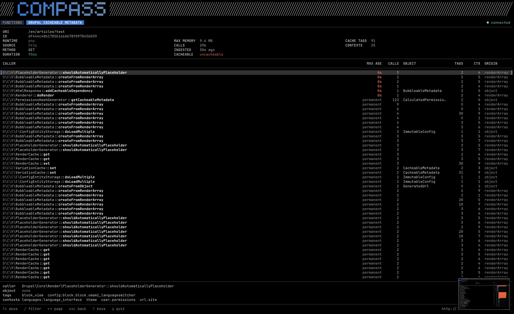
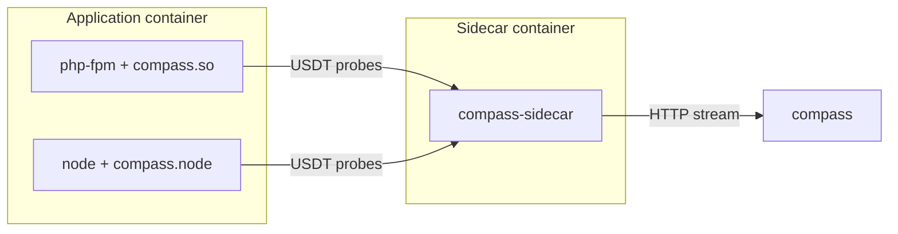
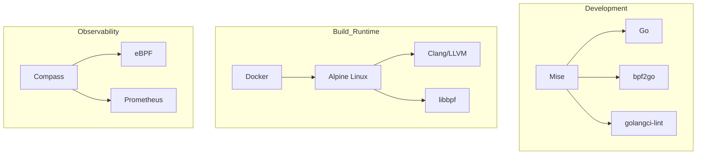

<p align="center"></p>

<h1 align="center">Compass</h1>

<p align="center">A toolkit for pointing developers in the right direction for performance issues.</p>

Compass shows you where a request spent its time — function by function — for PHP
and Node.js applications, without a profiler in the request path. Instrumentation
is emitted as [USDT](https://docs.kernel.org/trace/uprobetracer.html) probes,
collected out of process with eBPF, and streamed to a terminal UI.

**Trace List**



**Trace**



**Drupal Cacheable Metadata**



## How it works


```mermaid
graph LR
    subgraph Application container
        PHP[php-fpm + compass.so]
        Node[node + compass.node]
    end

    subgraph Sidecar container
        Sidecar[compass-sidecar]
    end

    PHP -- USDT probes --> Sidecar
    Node -- USDT probes --> Sidecar
    Sidecar -- HTTP stream --> CLI[compass]
```

| Component | Lives in | Role |
| --- | --- | --- |
| PHP extension (`compass.so`) | [`skpr/compass-extension`](https://github.com/skpr/compass-extension) | Emits USDT probes from PHP requests and CLI commands. |
| Node addon (`compass.node`) | [`nickschuch/compass-node`](https://github.com/nickschuch/compass-node) | Emits USDT probes from Node HTTP requests. |
| `compass-sidecar` | this repository | Attaches eBPF programs to those probes, assembles traces and streams them over HTTP. |
| `compass` | this repository | Terminal UI which connects to a sidecar and displays traces. |

The extension and addon are only probe *emitters* — they do nothing measurable
until the sidecar attaches to them, which it only does while a CLI is connected.

## Quickstart

The compose stack runs Drupal, a Node app, the sidecar and the CLI together:

```bash
# Build and start the stack.
docker compose up -d --build

# Generate some traffic.
curl http://localhost:8080
curl http://localhost:8080/frontend

# Watch traces.
docker compose exec compass compass
```

The interface has two levels. **Search** and **Logs** are the top one, and `←` /
`→` moves between them. Pressing `enter` on a trace in Search opens it, which
swaps the tabs for that trace's own pages — **Functions** and **Drupal Cacheable
Metadata** — that the same `←` / `→` then moves between. `esc` closes the trace
and returns to the main menu. The filled tab is the one you are on.

An open trace is described by a block of named fields above its pages: what was
requested, its id, how long it took, how much memory it used, and what Drupal
made of its cacheability. The block lays itself out in as many columns as the
terminal is wide enough for, with the values nobody wants abbreviated — the URI
and the request id — on rows of their own.

`/` narrows whichever list is on screen, including the Functions and Drupal
pages of an open trace; `?` shows the keys and what the glyphs mean, and `q`
quits.

**Functions** is where the request spent its time, in the order it ran, so the
page reads as a call sequence: what called what, and where the time went in
between. The timeline beside each row shows *when* in the request the call
happened and *for how long*, which puts a call visibly inside the one which
made it. The bar sits on a rail rather than on empty space, so its position is
readable even where the colour is not.

Colour and weight come from elapsed call duration as a share of the whole
request. A call which runs for 400ms during a 1s request reads as 40%; the same
share drives the percentage, the colour, and the gutter weight. Ordering stays
chronological, so nested callers and callees remain visible in the sequence in
which they ran.

The extension only fires a probe for calls above
`compass.function_threshold`, so the page is not an exhaustive call tree. Lower
the threshold when shorter calls are relevant.

Calls are aggregated into spans as their events arrive, rather than retained
one at a time: the calls of one function within one millisecond of the request
are a single span, carrying how many there were, the longest of them, and what
they cost altogether. That is what the page has always shown — nothing was ever
drawn per call — and it is what lets a request making a million calls be a
trace of a few hundred kilobytes. See [`docs/scaling.md`](docs/scaling.md).

A trace carries at most `COMPASS_SIDECAR_MAX_SPANS` spans, and roughly
*distinct functions × request duration / `COMPASS_SIDECAR_SPAN_BUCKET`* of them
are produced. A request which needs more than the bound allows has the calls it
could not place counted instead: Search adds `+` to its call count, and the
open trace reports exactly how many. The call count itself is exact either way,
and peak memory includes calls no span represents. A request which runs for
much longer than a second, or calls far more distinct functions than a page
usually does, wants a coarser bucket or a higher bound — see
[`docs/scaling.md`](docs/scaling.md).

**Drupal Cacheable Metadata** is what the Drupal specific probes reported. The
tab only appears when the trace has any: a Node trace, a PHP CLI run and any PHP
application which is not Drupal all have none, and a page which can only say
"there is nothing here" is not worth offering. Drupal derives the cacheability of a response as it builds it, and
the lowest max age that any part of the page contributes wins, so a single line
of code can make an otherwise cacheable page uncacheable. The page lists every
cacheability event Drupal produced, most restrictive first, with a max age of
zero — the thing which made the response uncacheable — shown in red.

Both trace pages abbreviate, and both carry a panel beneath the table showing
whichever row the cursor is on in full — so moving down a table is how you read
through the detail, rather than something you do and then look elsewhere for.

On **Functions** that is the whole name, which the table shortens to namespace
initials and then truncates, along with the numbers behind the two columns which
are a percentage and a picture: the call's elapsed duration as a share of the
request, and where in the request the call sat. On **Drupal Cacheable Metadata** it is the
cache tags and contexts, which the table only counts, and the object's full
class name — the namespace being exactly what says which module it came from.

Every list has a two cell gutter: the left marks the row the cursor is on, and
the right carries severity as a *weight*, from a hairline to a solid block. It
says the same thing as the colour beside it, in a channel which survives the
colour being turned off — so the interface still reads under `NO_COLOR` or over
a sixteen colour link.

The masthead draws the wordmark as block letterforms — six rows of pixels
rendered two to a character row with the half block glyphs — with a gradient
running across them from Compass's primary blue to the palette's dim blue,
standing in a field of diagonal hatching. At terminal resolution there is no
type size to reach for, so the only way to make something bigger is to draw it
out of more cells. The treatment is borrowed from
[crush](https://github.com/charmbracelet/crush).

Every colour on screen comes from the Skpr palette in `pkg/app/theme`, with two
exceptions: a derived grey — a blend of the palette's own White and Grey, for
the rung of the text hierarchy the palette does not have — and PHP's own purple
in the runtime column, because that column is naming somebody else's project.
There is a test asserting that list stays at two.

A red `●` beside the runtime on the Search list marks a request worth going and
looking at: something in it set a max age of zero, so the response cannot be
cached. It fires for that and nothing else — a mark which means two things stops
meaning either of them. `?` has the legend.

Function-call truncation is marked by `+` on the retained call count, while
dropped Drupal cache events are reported in the open trace. Neither changes the
attention dot, which remains reserved for an uncacheable response.

Each trace carries its request ID, taken from the `X-Request-ID` header, or its
process ID for a CLI run. Search shows the first eight characters, which is
enough to recognise a trace and enough to grep a log with; the open trace shows
the value in full. A request which arrived without the header has no ID, and
shows `·` rather than the extension's `UNKNOWN` placeholder.

## Install

Both binaries are published as container images on each release. Releases are
tagged by version, there is no `latest`:

```bash
docker pull ghcr.io/skpr/compass:v1.10.0          # CLI
docker pull ghcr.io/skpr/compass-sidecar:v1.10.0  # Sidecar
```

The sidecar needs to see the application's processes and load eBPF programs, so
it runs privileged and shares the application's PID namespace:

```yaml
  sidecar:
    image: ghcr.io/skpr/compass-sidecar:v1.10.0
    privileged: true
    pid: "service:php-fpm"
```

Then point the CLI at it:

```bash
compass --uri http://localhost:28624/v1/traces
```

### Node daemon

The sidecar runs one collector per instrumented pod. On a large cluster that is
a container in every pod. The **node daemon** is an alternative deployment: one
privileged collector per node, run as a DaemonSet in the host PID namespace,
which traces a single pod at a time chosen on the request rather than being
bound to one pod for its whole life.

A client names the pod by its UID:

```bash
compass --uri "http://<node>:28624/v1/traces?uid=$(kubectl get pod -n <ns> <pod> -o jsonpath='{.metadata.uid}')" --token "$COMPASS_TOKEN"
```

The daemon resolves that UID to the pod's processes by scanning the node's
`/proc` — no Kubernetes API access, service account, or RBAC is needed, only the
node it already runs on. It attaches the eBPF probes to the instrumented binary
in the target container and scopes the probes to the pod's cgroups, so a binary
whose inode overlayfs shares across pods from the same image still only reports
the pod that was asked for.

Because one daemon can trace any pod on its node, the token is **mandatory**: the
daemon refuses to start without `COMPASS_DAEMON_TOKEN` and gates both
`/v1/traces` and `/metrics` with it. A ready-to-edit DaemonSet, ServiceAccount
and Secret are in [`docs/daemon.yaml`](docs/daemon.yaml):

```bash
kubectl -n compass create secret generic compass-daemon \
  --from-literal=token="$(openssl rand -hex 32)"
kubectl apply -f docs/daemon.yaml
```

The CLI is unchanged: `--uri` already carries the query string, so pointing it at
`.../v1/traces?uid=<podUID>` is all a client does differently.

The application also needs the extension or addon installed. The compose stack
takes the PHP extension from its `skpr/php-fpm` base image, so the version it
gets is whichever that image ships — see `docker/compose/php-fpm/Dockerfile`.

The Node addon is installed from a `compass-node` release, see
`docker/compose/node/Dockerfile`.

The probe names and arities have to match the tracers in this repository
(`fpm_request_init`, `fpm_function`, `fpm_request_shutdown`, `cli_*` and
`canary`), so an older extension build will fail to attach.

The Drupal probes (`drupal_cacheablemetadata_createfromrenderarray` and
`drupal_cacheablemetadata_createfromobject`) are the exception: they are
attached when the extension has them and skipped when it does not, so an
extension predating them keeps its PHP tracing and loses only the Drupal page.

## Configuration

### CLI

| Flag | Environment variable | Default | Description |
| --- | --- | --- | --- |
| `--uri` | `COMPASS_URI` | `http://localhost:28624/v1/traces` | Trace stream to connect to, served as newline-delimited JSON (`application/x-ndjson`). `extension:///path/to/compass.so` traces a probe file directly. |
| `--token` | `COMPASS_TOKEN` | | Sent to the sidecar as the `X-Skpr-Token` header. |
| `--ca-file` | `COMPASS_CA_FILE` | | Certificate authority which signed the sidecar certificate. |
| `--insecure-skip-verify` | `COMPASS_INSECURE_SKIP_VERIFY` | `false` | Skip verification of the sidecar certificate. |
| `--max-traces` | `COMPASS_MAX_TRACES` | `500` | Traces to retain, oldest are discarded first. |
| `--max-logs` | `COMPASS_MAX_LOGS` | `1000` | Log events to retain, oldest are discarded first. |
| `--max-bytes` | `COMPASS_MAX_BYTES` | `268435456` | Bytes of retained traces, oldest are discarded first. A count alone does not bound memory, because traces differ in size by orders of magnitude. The newest trace is always kept, however large it is. |
| | `COMPASS_COLOR` | | Colour depth, when detection gets it wrong: `truecolor`, `256`, `16` or `none`. |

The CLI reconnects with a backoff if the sidecar restarts, and the footer shows
the current connection state.

Colour depth is detected from `TERM` and `COLORTERM`, and `NO_COLOR` turns it
off. A terminal which announces itself as a bare `xterm` — which is what
`docker exec` and some ssh setups hand over — is taken as 256 colours rather
than 16, because at 16 every colour resolves to an index in the reader's own
terminal theme and the palette stops being the palette. Set `COMPASS_COLOR` to
state the depth outright.

### Sidecar

Configured by environment variable, or with `--config` pointing at a YAML file —
see [`docs/sidecar-config.yaml`](docs/sidecar-config.yaml).

| Environment variable | Default | Description |
| --- | --- | --- |
| `COMPASS_SIDECAR_ADDR` | `:28624` | Address to serve traces and metrics on. |
| `COMPASS_SIDECAR_LOG_LEVEL` | `info` | `debug`, `info`, `warn` or `error`. |
| `COMPASS_SIDECAR_PHP_PROCESS_NAME` | `php-fpm` | Process which loads the PHP extension. |
| `COMPASS_SIDECAR_PHP_EXTENSION_PATH` | `/usr/lib/php/modules/compass.so` | Extension path, inside the PHP container. |
| `COMPASS_SIDECAR_NODE_PROCESS_NAME` | `node` | Process which loads the Node addon. |
| `COMPASS_SIDECAR_NODE_ADDON_PATH` | `/usr/lib/compass/node/compass.node` | Addon path, inside the Node container. |
| `COMPASS_SIDECAR_DISCOVERY_TIMEOUT` | `1m` | How long to wait for a runtime before deciding it is not present. |
| `COMPASS_SIDECAR_MAX_SPANS` | `10000` | Spans a trace carries. Calls which cannot be placed in one are counted as dropped. Replaces `COMPASS_SIDECAR_MAX_FUNCTION_CALLS`, which is still read and warned about. |
| `COMPASS_SIDECAR_SPAN_BUCKET` | `10ms` | How finely calls are placed in time. A trace holds roughly *distinct functions × request duration / bucket* spans, so a long request needs a coarser bucket to stay under the bound. |
| `COMPASS_SIDECAR_TOKEN` | | Require this token, as the `X-Skpr-Token` header, on both `/v1/traces` and `/metrics`. |
| `COMPASS_SIDECAR_CERT_FILE` | | Serve traces over TLS with this certificate. |
| `COMPASS_SIDECAR_KEY_FILE` | | Key for the TLS certificate. |

Runtimes are optional: a PHP-only deployment does not need Node, and vice versa.
The sidecar only fails to start when neither is found.

`/metrics` exposes Prometheus metrics, including
`compass_sidecar_runtime_discovered`, `compass_sidecar_subscriptions`,
`compass_sidecar_collector_running`, `compass_sidecar_traces_dropped_total`,
`compass_sidecar_function_events_dropped_total`,
`compass_sidecar_ringbuf_read_errors_total`,
`compass_sidecar_ringbuf_reserve_failures_total` and
`compass_sidecar_tracer_events_skipped_total`. The tracer counters use fixed
runtime and, where applicable, stream or reason labels so losses are visible without
unbounded metric cardinality.

### Daemon

The node daemon is configured by environment variable, or with `--config`
pointing at a YAML file with the same keys.

| Environment variable | Default | Description |
| --- | --- | --- |
| `COMPASS_DAEMON_ADDR` | `:28624` | Address to serve traces and metrics on. |
| `COMPASS_DAEMON_LOG_LEVEL` | `info` | `debug`, `info`, `warn` or `error`. |
| `COMPASS_DAEMON_TOKEN` | | **Required.** The daemon refuses to start without it and gates both `/v1/traces` and `/metrics` on the `X-Skpr-Token` header. |
| `COMPASS_DAEMON_PHP_EXTENSION_PATH` | `/usr/lib/php/modules/compass.so` | Extension path, as seen inside the target pod's container. |
| `COMPASS_DAEMON_NODE_ADDON_PATH` | `/usr/lib/compass/node/compass.node` | Addon path, as seen inside the target pod's container. |
| `COMPASS_DAEMON_PROC_ROOT` | `/proc` | Host `/proc` to scan for the target pod's processes. |
| `COMPASS_DAEMON_CGROUP_ROOT` | `/sys/fs/cgroup` | Host unified cgroup mount, used to resolve the cgroup ids the eBPF filter keys on. |
| `COMPASS_DAEMON_MAX_SPANS` | `10000` | Spans a trace carries. Calls which cannot be placed in one are counted as dropped. Replaces `COMPASS_DAEMON_MAX_FUNCTION_CALLS`, which is still read and warned about. |
| `COMPASS_DAEMON_SPAN_BUCKET` | `10ms` | How finely calls are placed in time. A trace holds roughly *distinct functions × request duration / bucket* spans, so a long request needs a coarser bucket to stay under the bound. |
| `COMPASS_DAEMON_CERT_FILE` | | Serve traces over TLS with this certificate. |
| `COMPASS_DAEMON_KEY_FILE` | | Key for the TLS certificate. |

Unlike the sidecar, the daemon discovers the runtime per request, inside the
pod named on the connection, rather than once at startup. A request for a pod
with no instrumented runtime — or one not scheduled on this node — is retried
with a backoff, so a client can connect before the pod is ready.

`/metrics` exposes `compass_daemon_subscriptions`,
`compass_daemon_collectors_running` and `compass_daemon_traces_dropped_total`.

## Event transport ABI

Lifecycle and function events use type-specific ring-buffer records. Payload sizes
come from the generated C layouts and are guarded by tests:

| Runtime | Previous fixed payload | Request init | Function | Shutdown |
| --- | ---: | ---: | ---: | ---: |
| Node HTTP / PHP FPM | 2,328 B | 2,216 B | 232 B | 112 B |
| PHP CLI | 248 B | 120 B | 136 B | 24 B |

The hot HTTP/FPM function payload is 10x smaller. Including the kernel ring-buffer's
8-byte record header and alignment, its record is 240 bytes, so a 1 MiB events
ring holds 4,369 records instead of 448 legacy fixed records.

A generated-layout decode benchmark on Linux/arm64 measured:

| Function decode | ns/op | B/op | allocs/op |
| --- | ---: | ---: | ---: |
| Legacy fixed 2,328-byte payload | 10,282 | 5,424 | 3 |
| Compact 232-byte payload | 1,053 | 288 | 2 |

The function record, which is the only one to arrive once per call, is decoded
at explicit offsets rather than by reflection: about 17ns against 1.6µs, and no
allocations. [`docs/scaling.md`](docs/scaling.md) has the measurements for each
stage of the pipeline at a million calls, and what to change next.

## Development

Tooling is managed with [mise](https://mise.jdx.dev/):

```bash
mise run generate   # Compile the eBPF programs with bpf2go.
mise run test       # Run the tests.
mise run test:race  # Run the tests with the race detector.
mise run lint       # Run golangci-lint.
mise run build      # Build both binaries into _output.
```

`generate` needs `clang`, `libbpf`, `bpftool` and kernel BTF
(`/sys/kernel/btf/vmlinux`), so it only runs on Linux. Everything above is also
available in the build image, which is how CI runs it:

```bash
docker build --target=test .      # Lint and test.
docker build --target=cli .       # Build the CLI image.
docker build --target=sidecar .   # Build the sidecar image.
```

## Toolchain


```mermaid
graph TD
    subgraph Development
        Mise[Mise] --> Go[Go]
        Mise --> BPF2Go[bpf2go]
        Mise --> Lint[golangci-lint]
    end

    subgraph Build_Runtime
        Docker[Docker] --> Alpine[Alpine Linux]
        Alpine --> Clang[Clang/LLVM]
        Alpine --> LibBpf[libbpf]
    end

    subgraph Observability
        Compass[Compass] --> eBPF[eBPF]
        Compass --> Prometheus[Prometheus]
    end
```
