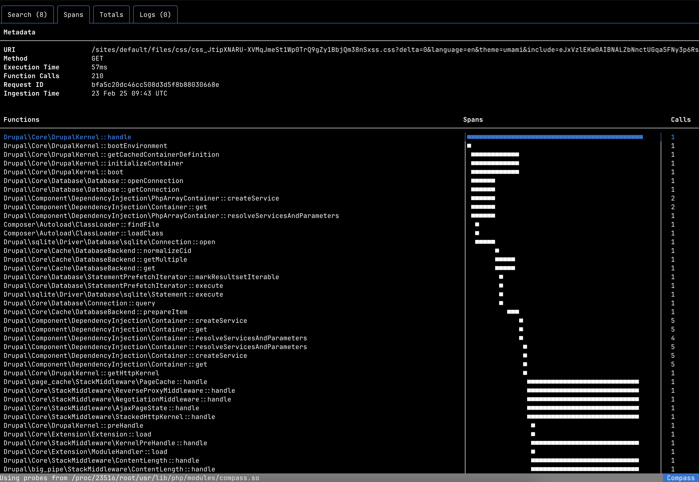
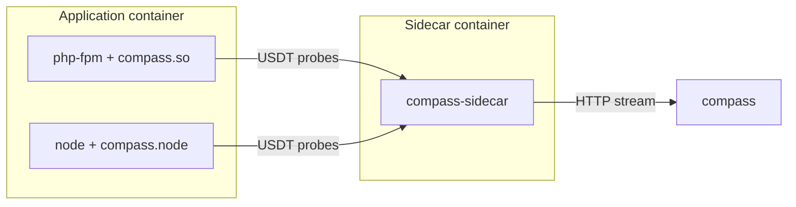
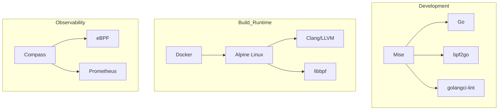

<p align="center"></p>

<h1 align="center">Compass</h1>

<p align="center">A toolkit for pointing developers in the right direction for performance issues.</p>

Compass shows you where a request spent its time — function by function — for PHP
and Node.js applications, without a profiler in the request path. Instrumentation
is emitted as [USDT](https://docs.kernel.org/trace/uprobetracer.html) probes,
collected out of process with eBPF, and streamed to a terminal UI.



## How it works


```mermaid
graph LR
    subgraph Application container
        PHP[php-fpm + compass.so]
        Node[node + compass.node]
    end

    subgraph Sidecar container
        Sidecar[compass-sidecar]
    end

    PHP -- USDT probes --> Sidecar
    Node -- USDT probes --> Sidecar
    Sidecar -- HTTP stream --> CLI[compass]
```

| Component | Lives in | Role |
| --- | --- | --- |
| PHP extension (`compass.so`) | [`skpr/compass-extension`](https://github.com/skpr/compass-extension) | Emits USDT probes from PHP requests and CLI commands. |
| Node addon (`compass.node`) | [`nickschuch/compass-node`](https://github.com/nickschuch/compass-node) | Emits USDT probes from Node HTTP requests. |
| `compass-sidecar` | this repository | Attaches eBPF programs to those probes, assembles traces and streams them over HTTP. |
| `compass` | this repository | Terminal UI which connects to a sidecar and displays traces. |

The extension and addon are only probe *emitters* — they do nothing measurable
until the sidecar attaches to them, which it only does while a CLI is connected.

## Quickstart

The compose stack runs Drupal, a Node app, the sidecar and the CLI together:

```bash
# Build and start the stack.
docker compose up -d --build

# Generate some traffic.
curl http://localhost:8080
curl http://localhost:8080/frontend

# Watch traces.
docker compose exec compass compass
```

Navigate with `←` / `→` between **Search**, **Spans**, **Totals** and **Logs**,
and press `enter` on the Search page to open a trace.

## Install

Both binaries are published as container images on each release. Releases are
tagged by version, there is no `latest`:

```bash
docker pull ghcr.io/skpr/compass:v1.10.0          # CLI
docker pull ghcr.io/skpr/compass-sidecar:v1.10.0  # Sidecar
```

The sidecar needs to see the application's processes and load eBPF programs, so
it runs privileged and shares the application's PID namespace:

```yaml
  sidecar:
    image: ghcr.io/skpr/compass-sidecar:v1.10.0
    privileged: true
    pid: "service:php-fpm"
```

Then point the CLI at it:

```bash
compass --uri http://localhost:28624/v1/traces
```

The application also needs the extension or addon installed. The PHP extension
is not published as an image, so the compose stack builds it from a pinned tag
of its repository — see `docker/compose/php-fpm/Dockerfile` for a recipe you can
copy into your own image, and override the tag with:

```bash
docker compose build --build-arg COMPASS_EXTENSION_REF=v0.0.6 php-fpm
```

The Node addon is installed from a `compass-node` release, see
`docker/compose/node/Dockerfile`.

The probe names and arities have to match the tracers in this repository
(`fpm_request_init`, `fpm_function`, `fpm_request_shutdown`, `cli_*` and
`canary`), so an older extension build will fail to attach.

## Configuration

### CLI

| Flag | Environment variable | Default | Description |
| --- | --- | --- | --- |
| `--uri` | `COMPASS_URI` | `http://localhost:28624/v1/traces` | Trace stream to connect to. `extension:///path/to/compass.so` traces a probe file directly. |
| `--token` | `COMPASS_TOKEN` | | Sent to the sidecar as the `X-Skpr-Token` header. |
| `--ca-file` | `COMPASS_CA_FILE` | | Certificate authority which signed the sidecar certificate. |
| `--insecure-skip-verify` | `COMPASS_INSECURE_SKIP_VERIFY` | `false` | Skip verification of the sidecar certificate. |
| `--max-traces` | `COMPASS_MAX_TRACES` | `500` | Traces to retain, oldest are discarded first. |

The CLI reconnects with a backoff if the sidecar restarts, and the footer shows
the current connection state.

### Sidecar

Configured by environment variable, or with `--config` pointing at a YAML file —
see [`docs/sidecar-config.yaml`](docs/sidecar-config.yaml).

| Environment variable | Default | Description |
| --- | --- | --- |
| `COMPASS_SIDECAR_ADDR` | `:28624` | Address to serve traces and metrics on. |
| `COMPASS_SIDECAR_LOG_LEVEL` | `info` | `debug`, `info`, `warn` or `error`. |
| `COMPASS_SIDECAR_PHP_PROCESS_NAME` | `php-fpm` | Process which loads the PHP extension. |
| `COMPASS_SIDECAR_PHP_EXTENSION_PATH` | `/usr/lib/php/modules/compass.so` | Extension path, inside the PHP container. |
| `COMPASS_SIDECAR_NODE_PROCESS_NAME` | `node` | Process which loads the Node addon. |
| `COMPASS_SIDECAR_NODE_ADDON_PATH` | `/usr/lib/compass/node/compass.node` | Addon path, inside the Node container. |
| `COMPASS_SIDECAR_DISCOVERY_TIMEOUT` | `1m` | How long to wait for a runtime before deciding it is not present. |
| `COMPASS_SIDECAR_TOKEN` | | Require this token from clients. |
| `COMPASS_SIDECAR_CERT_FILE` | | Serve traces over TLS with this certificate. |
| `COMPASS_SIDECAR_KEY_FILE` | | Key for the TLS certificate. |

Runtimes are optional: a PHP-only deployment does not need Node, and vice versa.
The sidecar only fails to start when neither is found.

`/metrics` exposes Prometheus metrics, including
`compass_sidecar_runtime_discovered`, `compass_sidecar_subscriptions`,
`compass_sidecar_collector_running` and `compass_sidecar_traces_dropped_total`.

## Development

Tooling is managed with [mise](https://mise.jdx.dev/):

```bash
mise run generate   # Compile the eBPF programs with bpf2go.
mise run test       # Run the tests.
mise run test:race  # Run the tests with the race detector.
mise run lint       # Run golangci-lint.
mise run build      # Build both binaries into _output.
```

`generate` needs `clang`, `libbpf`, `bpftool` and kernel BTF
(`/sys/kernel/btf/vmlinux`), so it only runs on Linux. Everything above is also
available in the build image, which is how CI runs it:

```bash
docker build --target=test .      # Lint and test.
docker build --target=cli .       # Build the CLI image.
docker build --target=sidecar .   # Build the sidecar image.
```

## Toolchain


```mermaid
graph TD
    subgraph Development
        Mise[Mise] --> Go[Go]
        Mise --> BPF2Go[bpf2go]
        Mise --> Lint[golangci-lint]
    end

    subgraph Build_Runtime
        Docker[Docker] --> Alpine[Alpine Linux]
        Alpine --> Clang[Clang/LLVM]
        Alpine --> LibBpf[libbpf]
    end

    subgraph Observability
        Compass[Compass] --> eBPF[eBPF]
        Compass --> Prometheus[Prometheus]
    end
```
